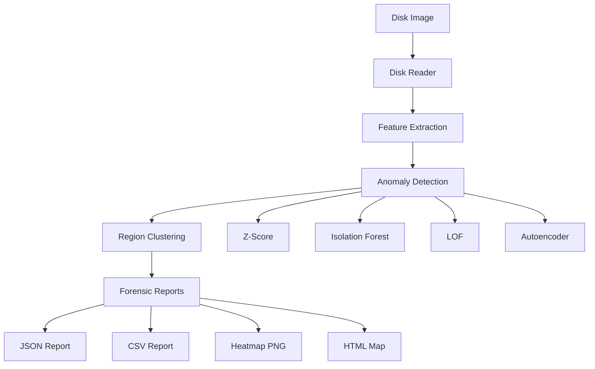

# EntropyGuard Architecture

## System Overview



## Module Structure

### Core Module (`entropyguard.core`)
- **disk_reader.py**: Streaming disk reader, never loads full disk into memory
- **entropy.py**: Shannon entropy, chi-square, byte frequency, serial correlation
- **byte_entropy.py**: Byte-level sliding window entropy scanner

### Features Module (`entropyguard.features`)
- **statistical.py**: Z-score anomaly detection
- **compression.py**: Compression ratio analysis

### Models Module (`entropyguard.models`)
- **isolation_forest.py**: sklearn Isolation Forest
- **lof.py**: Local Outlier Factor
- **autoencoder.py**: PyTorch Autoencoder (GPU support)
- **trainer.py**: Unified model training pipeline

### Pipeline Module (`entropyguard.pipeline`)
- **scanner.py**: Main orchestrator
- **processor.py**: Multi-process block processor
- **cluster.py**: Region clustering for suspicious areas

### Forensics Module (`entropyguard.forensics`)
- **reporter.py**: JSON/CSV report generation
- **exif_extractor.py**: EXIF metadata extraction

### Tools Module (`entropyguard.tools`)
- **mmls.py**: Partition table mapping (MBR/GPT)
- **fsstat.py**: Filesystem metadata analysis
- **fls.py**: Deleted file entries
- **bulk_extractor.py**: Artifact scanning

### Visualization Module (`entropyguard.visualization`)
- **heatmap.py**: PNG entropy heatmaps
- **html_map.py**: Interactive HTML maps

## Data Flow

1. **Input**: Disk image (dd, raw)
2. **Read**: Stream blocks via `DiskReader`
3. **Extract**: Calculate features per block
4. **Detect**: Run anomaly detection (multiple methods)
5. **Cluster**: Merge adjacent anomalies into regions
6. **Output**: Generate reports and visualizations

## Anomaly Scoring

Each block receives:
- `anomaly_score` (0-100): Higher = more likely encrypted/hidden
- `confidence` (0-100): Confidence in the score

Detection methods:
- **Z-Score**: Deviation from statistical baseline
- **Isolation Forest**: Isolation-based outliers
- **LOF**: Local density deviation
- **Autoencoder**: Reconstruction error (deep learning)

## Configuration

```yaml
block_size: 4096
num_workers: 4
methods:
  - zscore
  - isolation_forest
  - lof
  - autoencoder
```

## Performance Considerations

- **Streaming**: Never load full disk into memory
- **Parallel**: Multi-process block analysis
- **Resumable**: Save intermediate results to parquet
- **GPU**: Optional CUDA acceleration for Autoencoder
